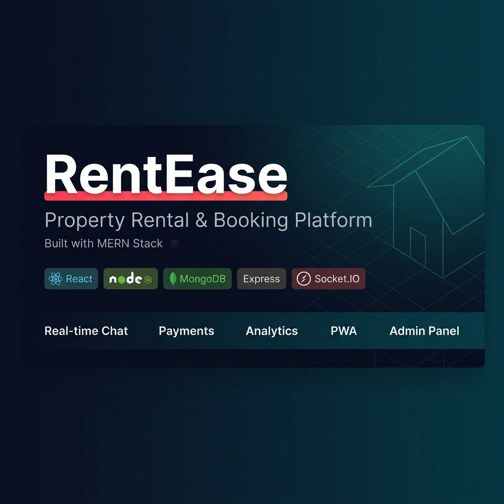
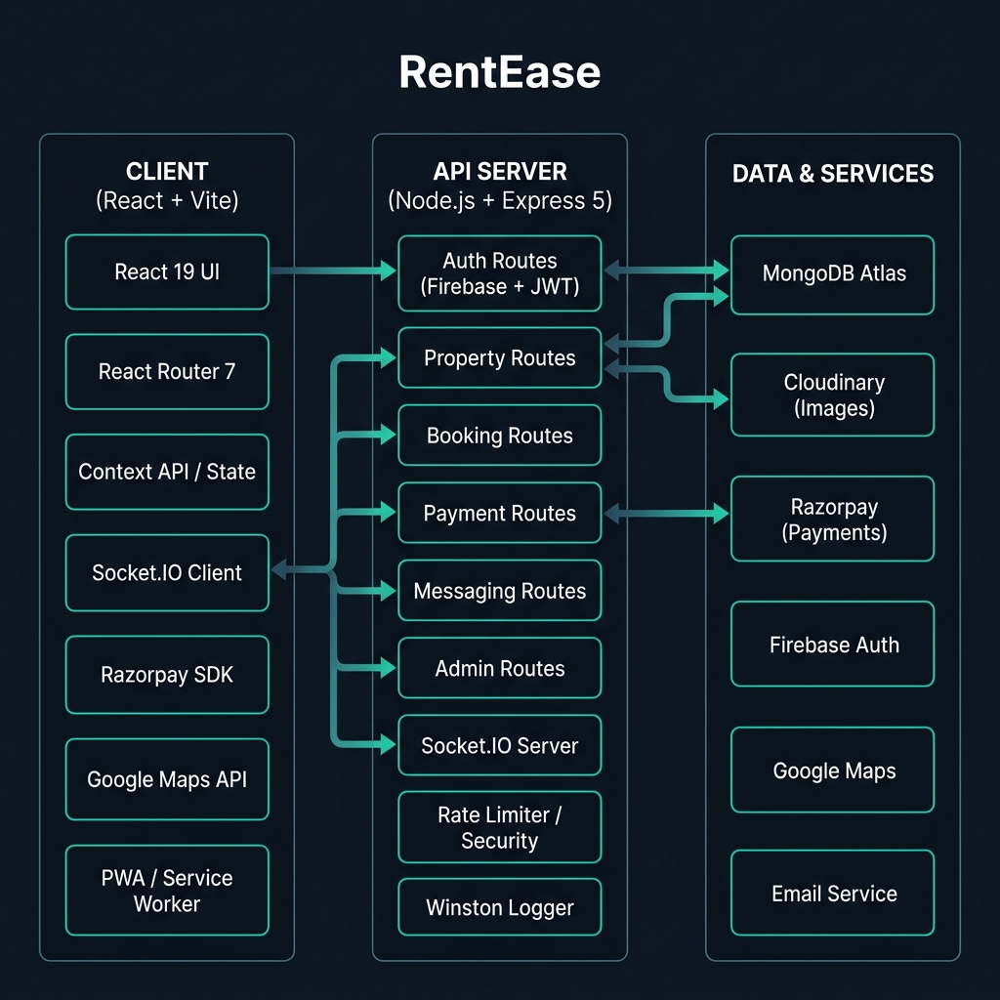
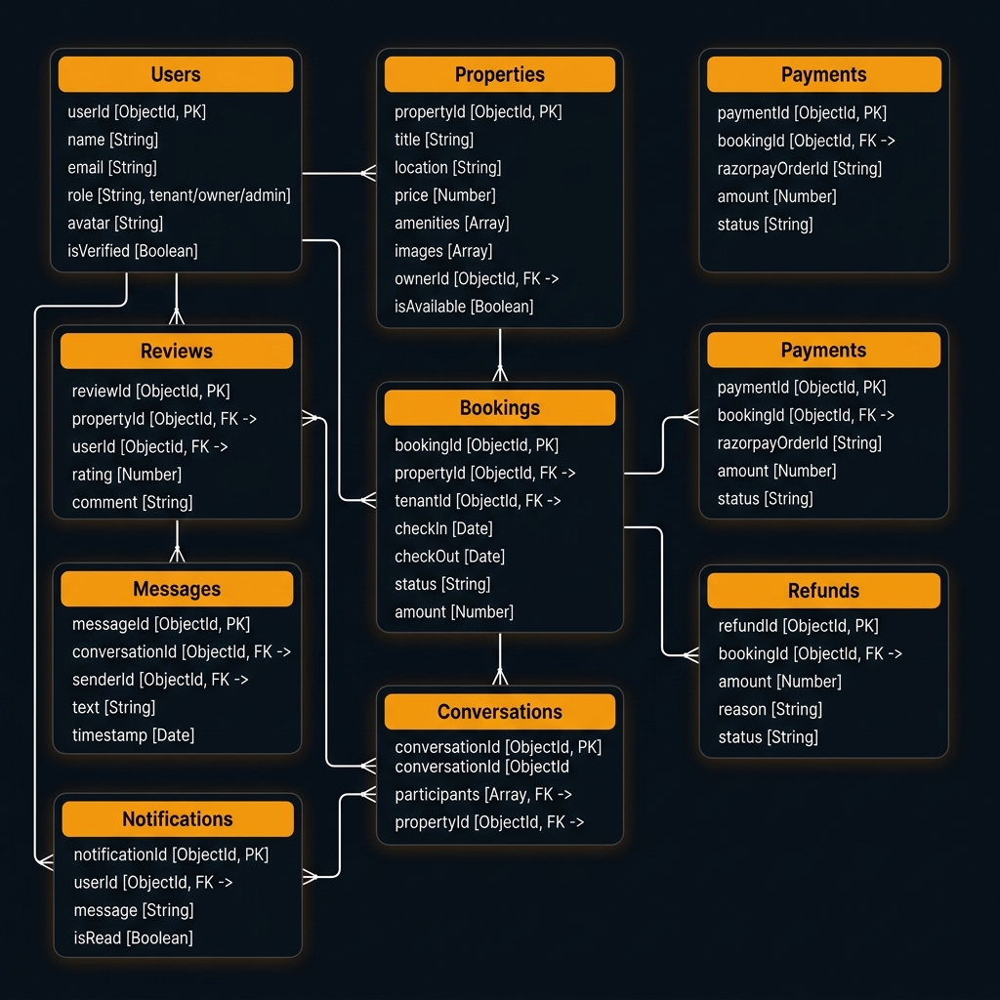

<div align="center">



<br/>

[](https://react.dev)
[](https://nodejs.org)
[](https://expressjs.com)
[](https://mongodb.com/atlas)
[](https://socket.io)
[](https://vite.dev)

[](LICENSE)
[](https://github.com/Sambram123/RentEase--Property-Rental-Booking-Platform/pulls)
[](https://vercel.com)

<h1>RentEase — Property Rental & Booking Platform</h1>

**A production-grade, full-stack Airbnb-style rental platform built with the MERN stack.**
Browse, list, book and manage rental properties with real-time chat, Razorpay payments, AI-powered recommendations, analytics dashboards, PWA support, and a full admin panel.

[🚀 Live Demo](#-live-deployment) · [📖 Docs](docs/) · [🏗 Architecture](#-architecture) · [🎯 Features](#-features) · [⚙️ Setup](#-local-setup)

</div>

---

## 🚀 Live Deployment

| Service  | URL                                              | Status |
|----------|--------------------------------------------------|--------|
| Frontend | https://rent-ease-property-rental-booking-p.vercel.app/            | [](https://vercel.com) |
| Backend  | https://rentease-property-rental-booking-platform.onrender.com/            | [](https://render.com) |


> **Demo Accounts** (seed with `node server/utils/seedDb.js` then `node server/utils/seedDemoData.js`):

---

## ✨ Features

<details>
<summary><b>🔐 Authentication & User Management</b></summary>

- Firebase Google OAuth + Email/Password sign-in
- JWT-secured REST API with refresh token strategy
- Role-based access control (Tenant / Owner / Admin)
- Avatar upload via Cloudinary
- Account settings, password change, profile management

</details>

<details>
<summary><b>🏠 Property Management (Owner)</b></summary>

- Full CRUD for property listings with rich metadata
- Multi-image upload (Cloudinary CDN)
- Availability calendar with blocked date management
- Publish / unpublish control
- Per-property revenue and occupancy analytics

</details>

<details>
<summary><b>🔍 Property Search & Discovery (Tenant)</b></summary>

- Keyword, city, type, and price-range search
- Multi-filter sidebar (amenities, bedrooms, bathrooms)
- **Google Maps** interactive map view with property pins
- **AI Recommendations** based on browsing & booking history
- Recently viewed properties with localStorage persistence
- Wishlist / save favourites

</details>

<details>
<summary><b>📅 Booking System</b></summary>

- Date-range picker with real-time availability check
- Instant booking confirmation with email notification
- Booking timeline visualization
- Tenant: My Bookings with status tracking
- Owner: Incoming booking management

</details>

<details>
<summary><b>💳 Payments & Refunds (Razorpay)</b></summary>

- Razorpay order creation and webhook verification
- Secure HMAC signature validation server-side
- Full and partial refund flow with owner approval
- Refund calculator (time-based policies)
- Payment history with receipts

</details>

<details>
<summary><b>💬 Real-time Messaging (Socket.IO)</b></summary>

- Per-property conversation threads
- Real-time message delivery with Socket.IO rooms
- Conversation list with unread badge counts
- Message read receipts
- Push notifications via in-app notification centre

</details>

<details>
<summary><b>🔔 Notifications</b></summary>

- Real-time in-app notifications (Socket.IO)
- Booking confirmations, refund updates, new messages
- Mark as read, mark all as read, delete
- Notification badge on navbar

</details>

<details>
<summary><b>📊 Dashboards & Analytics</b></summary>

- **Owner Dashboard** — revenue charts, occupancy rate, top listings, recent bookings
- **Admin Dashboard** — platform KPIs, user growth, property growth, booking trends
- **System Monitor** — uptime, memory usage, error logs, DB health
- **Performance Dashboard** — Core Web Vitals, page load metrics

</details>

<details>
<summary><b>🛡️ Admin Panel</b></summary>

- User management: list, ban/unban, role assignment
- Property moderation: approve, flag, remove
- Audit log viewer
- On-demand database backup
- System health checks

</details>

<details>
<summary><b>📱 PWA & Performance</b></summary>

- Installable Progressive Web App (manifest + service worker via Vite PWA)
- Offline fallback page
- Install prompt banner
- Lazy image loading with placeholder blur
- Skeleton loaders for all async content
- Lighthouse performance optimized

</details>

<details>
<summary><b>🔍 SEO</b></summary>

- Dynamic `<title>` and `<meta description>` per page via `SEO.jsx`
- Open Graph tags for social sharing
- Semantic HTML5 structure
- Structured data (JSON-LD ready)

</details>

---

## 🛠️ Tech Stack

| Layer          | Technology                                                         |
|----------------|--------------------------------------------------------------------|
| **Frontend**   | React 19, Vite 8, React Router 7, Tailwind CSS                     |
| **Backend**    | Node.js 18+, Express 5, Socket.IO 4                                |
| **Database**   | MongoDB Atlas, Mongoose 8                                          |
| **Auth**       | Firebase Authentication + JWT                                      |
| **Payments**   | Razorpay (Orders, Webhooks, Refunds)                               |
| **Storage**    | Cloudinary (property images, avatars)                              |
| **Maps**       | Google Maps JavaScript API (`@react-google-maps/api`)              |
| **Real-time**  | Socket.IO 4 (rooms, events, namespaces)                            |
| **Monitoring** | Winston logger, custom error monitor, in-memory cache              |
| **Testing**    | Vitest (unit), Jest (server), Playwright (E2E)                     |
| **Deployment** | Vercel (frontend), Render (backend), MongoDB Atlas (DB)            |

---

## 🏗 Architecture

<div align="center">

</div>

### System Flow

```
Browser / PWA
     │
     ├─── HTTPS ──► Vercel CDN (React + Vite SPA)
     │                    │
     │            React Router 7 (Client-side routing)
     │            Context API (Auth, Notifications, Socket)
     │
     └─── REST + WebSocket ──► Render (Express 5 API)
                                      │
                          ┌───────────┼────────────┐
                          │           │            │
                    MongoDB Atlas  Razorpay    Firebase Auth
                    (Mongoose 8)  (Payments)  (OAuth / JWT)
                          │
                    Cloudinary    Google Maps
                    (Images)      (Maps API)
```

### Database Collections

<div align="center">

</div>

| Collection      | Purpose                                        |
|-----------------|------------------------------------------------|
| `users`         | Tenant, Owner, Admin accounts + roles          |
| `properties`    | Listings with images, amenities, location      |
| `bookings`      | Reservations with date ranges and status       |
| `payments`      | Razorpay transaction records                   |
| `refunds`       | Refund requests with approval workflow         |
| `reviews`       | Post-stay ratings and comments                 |
| `conversations` | Message threads per property+user pair         |
| `messages`      | Individual messages with read status           |
| `notifications` | In-app notification events                     |
| `auditlogs`     | Admin action history                           |
| `savedSearches` | Tenant saved search filters                    |
| `availability`  | Owner-blocked date ranges                      |

---

## 📸 Screenshots

> Run the app locally or visit the live demo to explore all screens.

| Screen              | Description                                |
|---------------------|--------------------------------------------|
| Home                | Hero, property grid, search, map view      |
| Property Details    | Gallery, booking widget, reviews, map      |
| Booking Flow        | Date picker → Payment → Confirmation       |
| Tenant Dashboard    | Bookings, payments, notifications, chat    |
| Owner Dashboard     | Revenue chart, listings, availability cal  |
| Admin Panel         | User moderation, analytics, system health  |
| Messaging           | Real-time chat with Socket.IO              |

---

## ⚙️ Local Setup

### Prerequisites

- Node.js v18+
- MongoDB (local) or MongoDB Atlas account
- Firebase project (Auth)
- Razorpay account (Test Mode keys)
- Google Maps API key
- Cloudinary account

### Quick Start

```bash
# 1. Clone the repository
git clone https://github.com/Sambram123/RentEase--Property-Rental-Booking-Platform.git
cd RentEase--Property-Rental-Booking-Platform

# 2. Install all dependencies (root + client + server)
npm run install:all

# 3. Configure environment variables
cp server/.env.example server/.env
cp client/.env.example client/.env
# → Edit both files with your API keys (see sections below)

# 4. Seed demo accounts
node server/utils/seedDb.js

# 5. Seed demo properties, bookings, and reviews
node server/utils/seedDemoData.js

# 6. Start development servers (runs concurrently)
npm run dev
```

- **Frontend:** http://localhost:5173
- **Backend API:** http://localhost:5000
- **Health check:** http://localhost:5000/api/health

### Available Scripts

| Command                            | Description                               |
|------------------------------------|-------------------------------------------|
| `npm run dev`                      | Start client + server concurrently        |
| `npm run client`                   | Start frontend only                       |
| `npm run server`                   | Start backend only                        |
| `npm run install:all`              | Install all dependencies                  |
| `npm run test`                     | Run all unit tests                        |
| `npm run test:e2e`                 | Run Playwright E2E tests                  |
| `node server/utils/seedDb.js`      | Seed demo user accounts                   |
| `node server/utils/seedDemoData.js`| Seed demo properties, bookings, reviews   |

---

## 🔧 Environment Variables

### Backend — `server/.env`

```env
# Server
PORT=5000
NODE_ENV=development

# Database
MONGO_URI=mongodb://127.0.0.1:27017/rentease-dev
# Production: mongodb+srv://<user>:<password>@cluster.mongodb.net/rentease

# Auth
JWT_SECRET=your_64_char_random_secret_here
JWT_EXPIRE=7d

# CORS
CLIENT_URL=http://localhost:5173

# Razorpay (use Test keys for dev, Live keys for prod)
RAZORPAY_KEY_ID=rzp_test_xxxx
RAZORPAY_SECRET=your_razorpay_secret
```

> Full reference: [`server/.env.example`](server/.env.example)

### Frontend — `client/.env`

```env
VITE_API_URL=http://localhost:5000/api

# Razorpay (public key only)
VITE_RAZORPAY_KEY_ID=rzp_test_xxxx

# Google Maps
VITE_GOOGLE_MAPS_API_KEY=your_google_maps_key

# Firebase
VITE_FIREBASE_API_KEY=your_key
VITE_FIREBASE_AUTH_DOMAIN=your-project.firebaseapp.com
VITE_FIREBASE_PROJECT_ID=your-project-id
VITE_FIREBASE_STORAGE_BUCKET=your-project.firebasestorage.app
VITE_FIREBASE_MESSAGING_SENDER_ID=your_sender_id
VITE_FIREBASE_APP_ID=1:xxx:web:xxx
```

> Full reference: [`client/.env.example`](client/.env.example)

---

## 🌐 Deployment

### Backend → Render

1. Push repo to GitHub.
2. [render.com](https://render.com) → **New Web Service** → Connect repo.
3. `render.yaml` is auto-detected. Set env vars in the dashboard.
4. Required env vars: `NODE_ENV`, `MONGO_URI`, `JWT_SECRET`, `CLIENT_URL`, `RAZORPAY_KEY_ID`, `RAZORPAY_SECRET`.
5. Health check endpoint: `GET /api/health`

### Frontend → Vercel

1. [vercel.com](https://vercel.com) → **New Project** → Import repo.
2. Set **Root Directory** to `client`.
3. Add all `VITE_*` environment variables.
4. `client/vercel.json` handles SPA routing.

### Database → MongoDB Atlas

1. Create free M0 cluster at [mongodb.com/atlas](https://mongodb.com/atlas).
2. Create a DB user with read/write access.
3. Network Access → `0.0.0.0/0` (required for Render dynamic IPs).
4. Copy connection string → `MONGO_URI` in Render env vars.
5. Run seed: `node server/utils/seedDb.js` via Render Shell.

---

## 📁 Project Structure

```
RentEase/
├── client/                        # React + Vite Frontend
│   ├── public/                    # Static assets, manifest.json
│   ├── src/
│   │   ├── components/            # 30+ reusable UI components
│   │   │   ├── Navbar.jsx         # Top navigation with auth state
│   │   │   ├── PropertyCard.jsx   # Listing card with wishlist toggle
│   │   │   ├── ChatWindow.jsx     # Real-time messaging UI
│   │   │   ├── SEO.jsx            # Dynamic head/meta management
│   │   │   ├── SkeletonLoaders.jsx# Loading state placeholders
│   │   │   └── ...
│   │   ├── pages/                 # 20+ route-level page components
│   │   │   ├── Home.jsx           # Landing page with search
│   │   │   ├── Properties.jsx     # Search results + map view
│   │   │   ├── PropertyDetails.jsx# Listing detail + booking widget
│   │   │   ├── Dashboard.jsx      # Tenant dashboard
│   │   │   ├── OwnerDashboard.jsx # Owner analytics + management
│   │   │   ├── AdminDashboard.jsx # Admin panel (all features)
│   │   │   └── ...
│   │   ├── context/               # React Context providers
│   │   │   ├── AuthContext.jsx    # Firebase + JWT auth state
│   │   │   ├── SocketContext.jsx  # Socket.IO connection
│   │   │   └── NotificationContext.jsx
│   │   ├── services/              # Axios API client modules
│   │   ├── hooks/                 # Custom React hooks
│   │   └── utils/                 # Helper functions
│   ├── vite.config.js             # Vite + PWA plugin config
│   └── vercel.json                # Vercel SPA routing
│
├── server/                        # Express API Backend
│   ├── config/                    # MongoDB connection
│   ├── controllers/               # 18 route controllers
│   │   ├── authController.js      # Register, login, Firebase sync
│   │   ├── propertyController.js  # CRUD + search + filters
│   │   ├── bookingController.js   # Booking lifecycle management
│   │   ├── paymentController.js   # Razorpay orders + webhooks
│   │   ├── refundController.js    # Refund request + approval
│   │   ├── messageController.js   # Conversation + message CRUD
│   │   ├── adminController.js     # User/property moderation
│   │   ├── dashboardController.js # Owner analytics
│   │   └── ...
│   ├── models/                    # 12 Mongoose schemas
│   ├── middleware/                # Auth, CORS, rate limit, security
│   ├── routes/                    # API route definitions
│   ├── services/                  # Logger, cache, error monitor
│   ├── socket/                    # Socket.IO event handlers
│   ├── utils/
│   │   ├── seedDb.js              # Demo user accounts seeder
│   │   ├── seedDemoData.js        # Properties, bookings, reviews seeder
│   │   ├── refundCalculator.js    # Time-based refund policy
│   │   └── ...
│   └── server.js                  # Express app entry point
│
├── docs/                          # Project documentation
│   └── assets/                    # Architecture diagrams, screenshots
│
├── tests/                         # Playwright E2E tests
├── render.yaml                    # Render deployment config
└── playwright.config.js           # E2E test configuration
```

---

## 🧪 Testing

```bash
# Unit tests (Vitest — frontend)
npm run test:client

# Unit tests (Jest — backend)
npm run test:server

# E2E tests (Playwright)
npm run test:e2e

# E2E with browser UI visible
npm run test:e2e:headed
```

---

## 📡 API Reference

```
GET  /api/health              → Health ping (DB status, uptime)
GET  /api/status              → Detailed status (memory, version)

POST /api/auth/register       → Register with email/password
POST /api/auth/login          → Login, returns JWT
POST /api/auth/firebase       → Firebase token → JWT sync

GET  /api/properties          → List/search properties
POST /api/properties          → Create listing (Owner)
GET  /api/properties/:id      → Property details

POST /api/bookings            → Create booking
GET  /api/bookings/mine       → My bookings (Tenant)
PATCH /api/bookings/:id/cancel → Cancel booking

POST /api/payments/order      → Create Razorpay order
POST /api/payments/verify     → Verify payment signature

GET  /api/messages/conversations → List conversations
POST /api/messages            → Send message

GET  /api/notifications       → My notifications
PATCH /api/notifications/read-all → Mark all read

GET  /api/admin/users         → All users (Admin)
PATCH /api/admin/users/:id/ban → Ban/unban user (Admin)
```

---

## 🤝 Contributing

1. Fork the repository
2. Create a feature branch: `git checkout -b feature/your-feature`
3. Commit your changes: `git commit -m "feat: add your feature"`
4. Push to branch: `git push origin feature/your-feature`
5. Open a Pull Request

Please keep changes focused and include tests where applicable.

---

## 📄 License

MIT © 2026 RentEase

---

<div align="center">

Built with ❤️ using the **MERN Stack** · Production deployed

⭐ **Star this repo if you found it helpful!** ⭐

</div>
